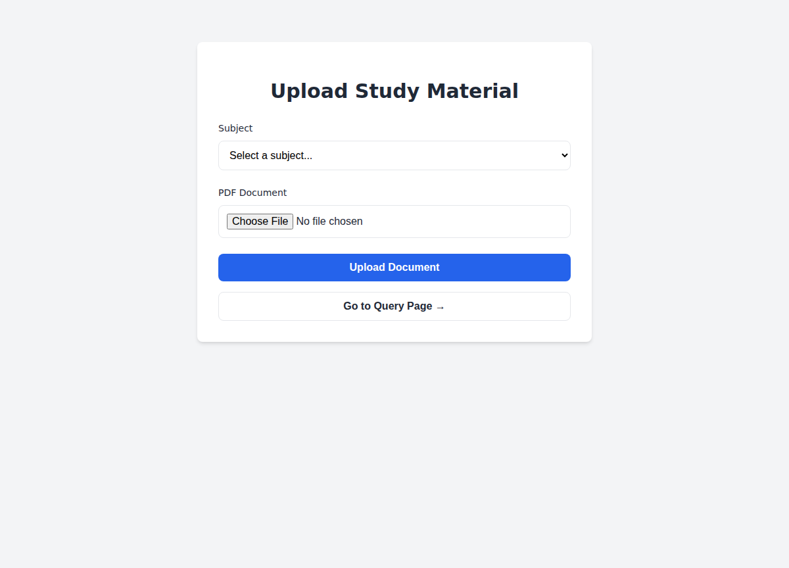
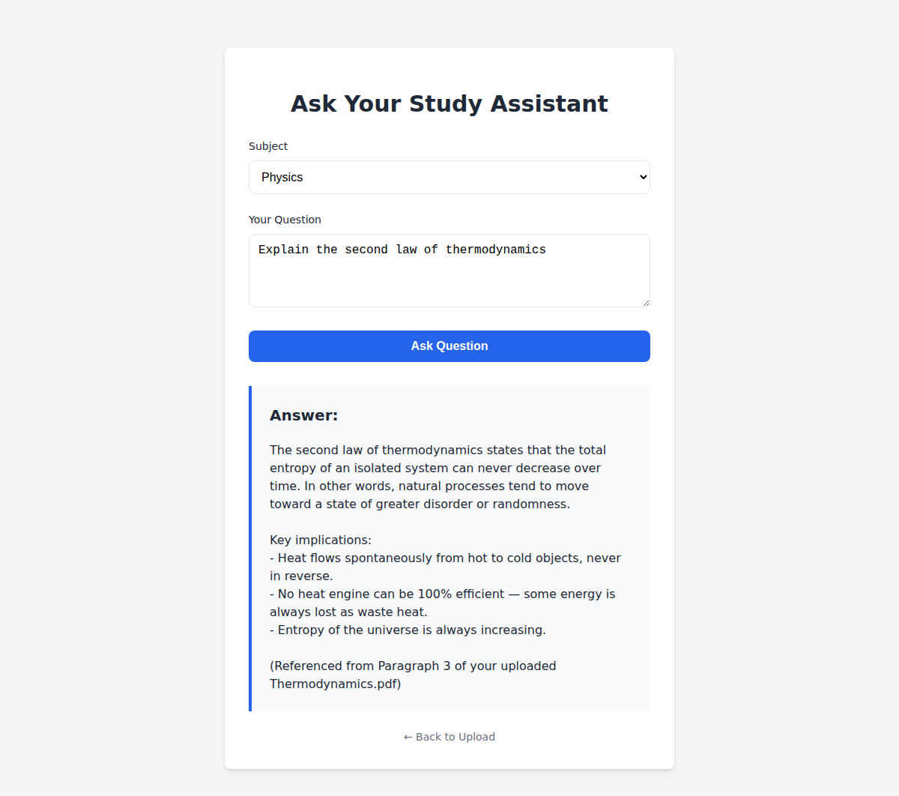

# 📚 RAG Study Assistant – Where PDFs Meet AI Intelligence 🤖


A **Retrieval-Augmented Generation (RAG)** powered study assistant that transforms your PDFs into **interactive AI knowledge bases**.  
Upload course materials, textbooks, or research papers, and ask natural language questions — the assistant retrieves and explains answers **directly from your document context**.

---

## 🌍 Overview

The **RAG Study Assistant** bridges the gap between **traditional PDFs** and **modern AI learning**.  
It extracts, embeds, and intelligently queries PDF content — turning static files into searchable, context-aware knowledge systems.

🧠 **Powered by:**  
- **FastAPI** for the web backend  
- **Groq LLM** for reasoning and contextual question-answering  
- **ChromaDB** for vector similarity search  
- **HuggingFace Transformers** for high-quality text embeddings  

---

## ⚡ Core Highlights

✅ **Smart PDF Uploading** – Categorize files by subject (Physics, Chemistry, etc.)  
✅ **Text Extraction** – Extracts readable text using `pdfminer.six`  
✅ **Semantic Chunking** – Breaks documents into manageable, meaningful parts  
✅ **Vector Storage** – Embeds and stores chunks using `ChromaDB`  
✅ **Contextual Question Answering** – Powered by `Groq LLM`  
✅ **FastAPI Backend** – Secure and scalable API handling  
✅ **Minimal Frontend** – Clean HTML/CSS UI for upload and query pages  
✅ **Persistent Local Storage** – Saves your subjects in browser localStorage  
✅ **User Feedback UI** – Real-time progress bar and success alerts  

---

## 🧠 Tech Stack

| Layer | Technology | Role |
|-------|-------------|------|
| **Framework** | [FastAPI](https://fastapi.tiangolo.com/) | Backend web API |
| **Language** | Python 3.10+ | Core logic |
| **Embeddings** | [Sentence-Transformers (all-MiniLM-L6-v2)](https://huggingface.co/sentence-transformers/all-MiniLM-L6-v2) | Converts text → vector |
| **Vector DB** | [ChromaDB](https://www.trychroma.com/) | Stores document embeddings |
| **LLM API** | [Groq](https://groq.com/) | Generates answers using document context |
| **PDF Parser** | [pdfminer.six](https://pypi.org/project/pdfminer.six/) | Extracts text from PDFs |
| **Frontend** | HTML, CSS, JS | Lightweight UI |
| **Splitter** | [LangChain RecursiveCharacterTextSplitter](https://python.langchain.com/docs/modules/data_connection/document_transformers/) | Text segmentation |

---

## 🧩 System Workflow

### 📥 Upload Flow
1. User uploads a PDF and selects a subject.
2. FastAPI extracts text via `pdfminer.six`.
3. Text is split into chunks (1000 chars + 150 overlap).
4. Embeddings generated via `HuggingFace`.
5. Chunks + embeddings stored in ChromaDB by subject.

### 💬 Query Flow
1. User selects a subject and enters a question.  
2. Query embedded → top `k` relevant chunks fetched.  
3. Context + question sent to Groq LLM.  
4. Detailed, referenced answer returned.

---

## 🧭 Architecture Diagram

```mermaid
flowchart TD
A[📤 User Uploads PDF] -->|POST /upload| B[FastAPI Backend]
B --> C[pdfminer: Extract Text]
C --> D[LangChain Splitter: Chunk Text]
D --> E[HuggingFace Embeddings]
E --> F[ChromaDB: Store Embeddings]

subgraph Database Layer
F[ChromaDB Vector Store]
end

G[💬 User Asks Question] -->|POST /query| B
B --> H[Embed Query with HuggingFace]
H --> I[Search in ChromaDB]
I --> J[Retrieve Top-k Relevant Chunks]
J --> K[Groq LLM: Generate Answer]
K --> L[Return JSON Response]
L --> M[Frontend Displays AI Answer]
````

---

## 🔁 Sequence of Operations

```mermaid
sequenceDiagram
    participant User
    participant Frontend
    participant FastAPI
    participant ChromaDB
    participant GroqLLM

    User->>Frontend: Upload PDF / Ask Question
    Frontend->>FastAPI: POST /upload or /query
    FastAPI->>ChromaDB: Store or Retrieve Vectors
    ChromaDB-->>FastAPI: Return Document Chunks
    FastAPI->>GroqLLM: Send Context + Question
    GroqLLM-->>FastAPI: Return Detailed Answer
    FastAPI-->>Frontend: JSON Response
    Frontend-->>User: Display in Browser UI
```

---

## 📁 Project Structure

```
📦 RAG-Study-Assistant/
├── main.py                 # FastAPI application entrypoint
├── subjects.py             # Core RAG logic (extract, embed, query)
├── templates/
│   ├── index.html          # Upload page
│   └── query.html          # Query page
├── savepdf/                # Uploaded PDFs
├── vecDB1/                 # Persistent Chroma vector DB
├── requirements.txt        # Dependencies
└── README.md               # Documentation
```

---

## 🛠️ Installation Guide

### 1️⃣ Clone Repository

```bash
git clone https://github.com/HassanCodesIt/RAG-Study-Assistant.git
cd RAG-Study-Assistant
```

### 2️⃣ Create a Virtual Environment

```bash
python -m venv venv
venv\Scripts\activate     # Windows
source venv/bin/activate  # macOS/Linux
```

### 3️⃣ Install Dependencies

```bash
pip install -r requirements.txt
```

### 4️⃣ Configure API Key

In `subjects.py`:

```python
client = Groq(api_key="YOUR_GROQ_API_KEY")
```

### 5️⃣ Launch Application

```bash
uvicorn main:app --reload
```

Access it at 👉 **[http://127.0.0.1:8000](http://127.0.0.1:8000)**

---

## 🧩 Example Use Case

1. Upload: `Thermodynamics.pdf` under *Physics*
2. Query: “Explain the second law of thermodynamics”
3. Response:

   ```
   The second law states that the total entropy of an isolated system always increases...
   (Mentioned in Paragraph 3 of your document)
   ```

---

## 🖥️ App Screenshots

### 📤 Upload Page
Upload your PDF documents and categorize them by subject.



### 💬 Query Page
Ask natural language questions about your uploaded study materials.


### 🤖 AI Answer in Action
Get detailed, contextual answers referenced directly from your documents.



---

## 🚀 Key Functions Explained

### `extraction(file_path)`

Extracts and cleans text from PDF.

### `vectordbadd(text, subject)`

Splits, embeds, and stores chunks in ChromaDB.

### `vectordbget(subject, query)`

Retrieves semantically similar document chunks.

### `llm(prompt, context)`

Generates contextual, paragraph-referenced answers via Groq LLM.

---

## ⚡ Performance Optimizations

* Lightweight model (`all-MiniLM-L6-v2`) ensures CPU efficiency.
* Persistent ChromaDB enables quick reloads.
* Streamed Groq responses minimize latency.
* Simple UI ensures fast load times and usability.

---

## 🔮 Future Enhancements

* [ ] Multi-file per subject support
* [ ] PDF-level metadata and file tracking
* [ ] Authentication for multi-user access
* [ ] Support for local models (DeepSeek, Ollama)
* [ ] Chat-style conversation memory

---

## 🧾 License

**MIT License © 2025 [HassanCodesIt](https://github.com/HassanCodesIt)**
Feel free to fork, modify, and expand this project.

---

## 🙌 Acknowledgments

* [LangChain](https://www.langchain.com/)
* [ChromaDB](https://www.trychroma.com/)
* [HuggingFace Transformers](https://huggingface.co/)
* [Groq LLM](https://groq.com/)
* [FastAPI](https://fastapi.tiangolo.com/)
* [pdfminer.six](https://pypi.org/project/pdfminer.six/)


> 🧩 *Built with FastAPI, Groq, HuggingFace, and caffeine ☕ — making PDFs talk intelligently.*


